# NutriFlow - Complete Nutritional Calculation & Meal Plan Generation Audit Report

## Executive Summary

This audit reveals a **complex multi-path calculation system** with significant duplications, inconsistencies, and architectural issues. The system currently has **4+ parallel calculation engines** running simultaneously, creating risks for data integrity and user confusion.

**Key Findings:**
- 🔴 **Critical**: Multiple contradictory formula implementations 
- 🔴 **Critical**: No centralized truth source for calculations
- 🔴 **Critical**: Meal plan generation uses inconsistent data sources
- ⚠️ **High**: Embedded calculation logic in React components
- ⚠️ **High**: Formula accuracy deviations from specifications

---

## 1. Formula Implementation Analysis

### 1.1 Currently Implemented Formulas

| Formula | Implementation Files | Status | Notes |
|---------|---------------------|--------|--------|
| **Harris-Benedict** | 6+ files | ❌ **INCONSISTENT** | Multiple versions with different coefficients |
| **Mifflin-St Jeor** | 4+ files | ❌ **INCONSISTENT** | Used for obesity cases but coefficients vary |
| **Tinsley** | 3+ files | ❌ **INCOMPLETE** | Placeholder implementation, missing exact formula |
| **ENP Standard** | 3 files | ⚠️ **PARTIAL** | Custom implementation, not matching audit specification |

### 1.2 Formula Accuracy Issues

#### Harris-Benedict Inconsistencies
**File: `src/utils/nutrition/centralMotor/enpCore.ts`**
```typescript
// ❌ INCORRECT coefficients
if (gender === 'M') {
  return 66.5 + (13.75 * weight) + (5.003 * height) - (6.75 * age);
} else {
  return 655.1 + (9.563 * weight) + (1.850 * height) - (4.676 * age);
}
```

**File: `src/utils/nutrition/official/formulas.ts`**
```typescript
// ✅ CORRECT coefficients (matches audit specification)
if (gender === 'M') {
  return 66 + (13.7 * weight) + (5.0 * height) - (6.8 * age);
} else {
  return 655 + (9.6 * weight) + (1.8 * height) - (4.7 * age);
}
```

#### Missing Tinsley Implementation
- **Current**: `return 24.2 * weight + 370;` (placeholder)
- **Specification**: Weight-only formula for athletes (exact coefficients needed)

---

## 2. Calculation Engine Architecture

### 2.1 Parallel Calculation Systems Identified

| System | Path | Purpose | Status |
|--------|------|---------|---------|
| **Legacy Core** | `src/utils/calculations/core.ts` | Original system | 🔴 DEPRECATED |
| **ENP Motor** | `src/utils/nutrition/enp/` | ENP standard implementation | ⚠️ ACTIVE |
| **Central Motor** | `src/utils/nutrition/centralMotor/` | Unified system attempt | ⚠️ ACTIVE |
| **Official Formulas** | `src/utils/nutrition/official/` | Audit-compliant system | ✅ NEWEST |
| **Clean Calculations** | `src/utils/nutrition/cleanCalculations.ts` | Wrapper system | ⚠️ ACTIVE |

### 2.2 Data Flow Problems

```mermaid
graph TD
    A[User Input] --> B[Multiple Calculation Paths]
    B --> C[Legacy Core]
    B --> D[ENP Motor] 
    B --> E[Central Motor]
    B --> F[Official Formulas]
    
    C --> G[Different Results]
    D --> G
    E --> G
    F --> G
    
    G --> H[❌ Inconsistent Data]
```



**Critical Issues:**
- No single source of truth
- Different calculation paths can produce different results for same inputs
- Wrappers redirecting to deprecated systems

---

## 3. Hook Architecture Analysis

### 3.1 Calculation Hooks Inventory

| Hook | File | Function | Issues |
|------|------|----------|---------|
| `useCalculator` | `src/hooks/useCalculator.ts` | Main calculator interface | ✅ Delegates to consolidated system |
| `useCalculatorFix` | `src/hooks/useCalculatorFix.ts` | ENP-specific calculations | ⚠️ Uses ENP system directly |
| `useNutritionCalculation` | `src/hooks/useNutritionCalculation.ts` | General nutrition interface | 🔴 DEPRECATED wrapper |
| `useNutritionCalculator` | `src/hooks/useNutritionCalculator.ts` | Core calculation logic | 🔴 Points to deprecated code |
| `useConsolidatedNutrition` | `src/hooks/useConsolidatedNutrition.ts` | E2E workflow nutrition | ⚠️ Has embedded calculation logic |
| `useOfficialCalculations` | `src/hooks/useOfficialCalculations.ts` | Audit-compliant calculations | ✅ Uses correct formulas |

### 3.2 Embedded Calculation Logic Risk

**High-Risk File: `src/hooks/useConsolidatedNutrition.ts`**
```typescript
// ❌ CRITICAL: Business logic embedded in hook
const bmr = sex === 'male' 
  ? 88.362 + (13.397 * input.weight) + (4.799 * input.height) - (5.677 * input.age)
  : 447.593 + (9.247 * input.weight) + (3.098 * input.height) - (4.330 * input.age);
```

**Problems:**
- Calculation logic duplicated in multiple files
- No central validation
- Difficult to maintain formula accuracy

---

## 4. Meal Plan Generation Flow

### 4.1 Generation Architecture


### 4.2 Services Inventory

| Service | File | Function | Status |
|---------|------|----------|--------|
| **MealPlanService** | `src/services/mealPlanService.ts` | Legacy meal plan generation | 🔴 OLD |
| **MealPlanServiceV2** | `src/services/mealPlan/MealPlanServiceV2.ts` | Current generation service | ✅ ACTIVE |
| **MealPlanServiceV3** | `src/services/mealPlan/MealPlanServiceV3.ts` | Retrieval service | ✅ ACTIVE |
| **PlanWorkflowService** | `src/services/workflow/planWorkflow.ts` | Orchestration service | ✅ NEWEST |

### 4.3 Data Flow Issues

**Critical Problem: Inconsistent Calculation Sources**

The meal plan generation workflow has multiple entry points that may use different calculation systems:

1. **Direct Hook Usage**: `useMealPlanGeneration` → `MealPlanServiceV2`
2. **Workflow Orchestration**: `PlanWorkflowService` → Creates own calculations → `MealPlanServiceV2`
3. **Component Direct Calls**: Various components → Different calculation hooks → Different services

---

## 5. React Component Calculation Logic

### 5.1 Components with Embedded Calculation Logic

| Component | File | Embedded Logic | Risk Level |
|-----------|------|---------------|------------|
| **ENP Calculator Form** | `src/components/calculator/enp/ENPCalculatorForm.tsx` | Formula selection logic | ⚠️ Medium |
| **Nutritional Calculation Step** | `src/components/workflow/steps/NutritionalCalculationStep.tsx` | Profile-formula mapping | ⚠️ Medium |
| **Patient Data Handler** | `src/components/calculator/components/PatientDataHandler.tsx` | Default calculation values | 🔴 High |
| **Meal Plan Assembly** | `src/components/MealPlan/MealPlanAssembly.tsx` | Macro calculation logic | 🔴 High |

### 5.2 Example of Problematic Embedded Logic

**File: `src/components/MealPlan/MealPlanAssembly.tsx`**
```typescript
// ❌ CRITICAL: Macro calculations in UI component
const protein = Math.round(macros.protein * dist.proteinPercent);
const carbs = Math.round(macros.carbs * dist.carbsPercent);  
const fat = Math.round(macros.fat * dist.fatPercent);
```

**Problems:**
- Business logic mixed with presentation
- No validation or error handling
- Difficult to test and maintain

---

## 6. Consistency Issues & Divergences

### 6.1 Formula Selection Logic Inconsistencies

**Different Profile Mappings Across Files:**

```typescript
// File A: src/utils/nutrition/centralMotor/enpCore.ts
if (profile === 'obeso_sobrepeso') {
  value = calculateTMB_MifflinStJeor(weight, height, age, gender);
} else {
  value = calculateTMB_HarrisBenedict(weight, height, age, gender);
}

// File B: src/components/workflow/EnergyCalculationStep.tsx  
<SelectItem value="eutrofico">Eutrófico/Magro (Harris-Benedict)</SelectItem>
<SelectItem value="sobrepeso_obesidade">Sobrepeso/Obesidade (Mifflin-St Jeor)</SelectItem>
<SelectItem value="atleta">Atleta/Musculoso (Tinsley)</SelectItem>
```

### 6.2 Activity Factor Inconsistencies

**Multiple Activity Factor Definitions:**

```typescript
// Definition 1: src/utils/nutrition/centralMotor/enpCore.ts
ACTIVITY_FACTORS: {
  sedentario: 1.2,
  leve: 1.375,
  moderado: 1.55,
  muito_ativo: 1.725,        // ❌ Different key
  extremamente_ativo: 1.9    // ❌ Different key
}

// Definition 2: src/utils/nutrition/official/formulas.ts  
ACTIVITY_FACTORS: {
  sedentario: 1.2,
  leve: 1.375,
  moderado: 1.55,
  intenso: 1.725,           // ❌ Different key
  muito_intenso: 1.9        // ❌ Different key
}
```

### 6.3 Macronutrient Calculation Divergences

**Fixed Ratios vs Manual Input:**

- **ENP System**: Uses fixed ratios per profile (1.8g/kg, 2.0g/kg, 2.2g/kg for protein)
- **Official System**: Expects manual user input for protein and fat g/kg
- **Components**: Some calculate directly without using any service

---

## 7. Error Risk Assessment

### 7.1 Critical Risks

| Risk Category | Impact | Probability | Examples |
|--------------|---------|-------------|----------|
| **Calculation Inconsistency** | 🔴 HIGH | 🔴 HIGH | Same patient, different results across UI |
| **Formula Accuracy** | 🔴 HIGH | ⚠️ MEDIUM | Wrong Harris-Benedict coefficients |
| **Data Loss** | 🔴 HIGH | ⚠️ MEDIUM | Meal plan generation with wrong calculation data |
| **User Confusion** | ⚠️ MEDIUM | 🔴 HIGH | Different results in different screens |

### 7.2 Specific Error Scenarios

1. **Scenario A**: User calculates nutrition in Calculator → Gets Result A → Generates meal plan → Meal plan uses different calculation system → Result B ≠ Result A

2. **Scenario B**: Two users with same patient data use different entry points → Get different TMB values due to different Harris-Benedict implementations

3. **Scenario C**: Component directly calculates macros → Doesn't match saved calculation in database → Meal plan generation fails or uses wrong data

---

## 8. Current System Dependencies

### 8.1 File Dependency Graph

```
useCalculator.ts
├── useConsolidatedNutrition.ts (fallback)
├── calculateCompleteNutrition (centralMotor)
│   ├── calculateTMB (multiple implementations)
│   ├── calculateGEA (ENP system)
│   └── calculateMacronutrients (various systems)
└── Legacy compatibility wrappers

MealPlanWorkflow
├── useConsolidatedNutrition.ts (embedded calculations)
├── PlanWorkflowService.gerarPlanoAlimentar()
│   ├── Harris-Benedict (embedded in workflow)
│   └── MealPlanServiceV2.generateMealPlan()
└── Multiple Supabase RPC calls
```

### 8.2 Import Chain Analysis

**Circular Dependencies Detected:**
- `nutritionCalculations.ts` → `centralMotor/index.ts` → `wrappers.ts` → `nutritionCalculations.ts`
- Multiple files importing deprecated systems through re-exports

---

## 9. Problem Areas Summary

### 9.1 Immediate Action Required

| Priority | Issue | Files Affected | Impact |
|----------|-------|----------------|---------|
| 🔴 **P0** | Harris-Benedict coefficient errors | 6+ files | Incorrect calculations |
| 🔴 **P0** | Multiple active calculation engines | 15+ files | Data inconsistency |
| 🔴 **P0** | Embedded calculation logic in components | 8+ files | Maintainability crisis |
| 🔴 **P0** | Missing Tinsley implementation | 3 files | Feature incomplete |

### 9.2 Architectural Issues

| Issue | Description | Risk Level |
|-------|-------------|------------|
| **No Single Source of Truth** | 4+ calculation systems active simultaneously | 🔴 CRITICAL |
| **Calculation-Component Coupling** | Business logic embedded in React components | 🔴 CRITICAL |
| **Inconsistent Data Flow** | Meal plan generation uses multiple data sources | 🔴 CRITICAL |
| **Formula Accuracy** | Multiple implementations of same formulas with different results | ⚠️ HIGH |
| **Deprecated Code Active** | Legacy systems still being used in production | ⚠️ HIGH |

### 9.3 Deviation from Audit Specification

**Major Deviations Found:**

1. **Harris-Benedict Coefficients**: Current implementation uses wrong coefficients in primary system
2. **Manual Macro Input Missing**: System uses fixed ratios instead of user input for protein/fat g/kg
3. **Tinsley Formula**: Placeholder implementation instead of correct weight-only formula
4. **Carbohydrate Calculation**: Some systems use fixed ratios instead of "by difference" method
5. **Meal Distribution**: Some implementations don't validate 100% total requirement

---

## 10. Recommendations for Next Phase

### 10.1 Immediate Fixes Required

1. **Standardize Harris-Benedict Formula** across all implementations
2. **Implement Correct Tinsley Formula** with verified coefficients
3. **Centralize Calculation Logic** - remove from React components
4. **Create Single Calculation Entry Point** - deprecate all other systems
5. **Implement Manual Macro Input** as specified in audit requirements

### 10.2 Architecture Restructuring Needed

1. **Single Calculation Engine**: Consolidate to one system (recommend `official/formulas.ts`)
2. **Service Layer Separation**: Remove calculation logic from hooks and components
3. **Validation Layer**: Centralized input validation and error handling
4. **Data Flow Standardization**: One path from patient data → calculation → meal plan
5. **Testing Suite**: Comprehensive tests for all formulas against known values

This audit reveals a system in critical need of consolidation and standardization to ensure calculation accuracy and maintainability.